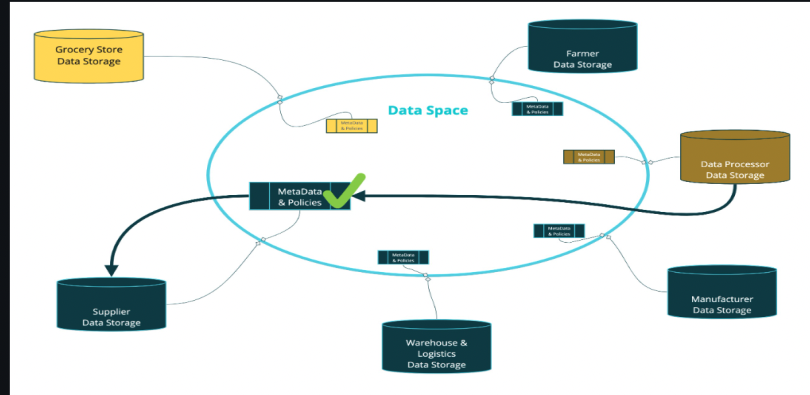
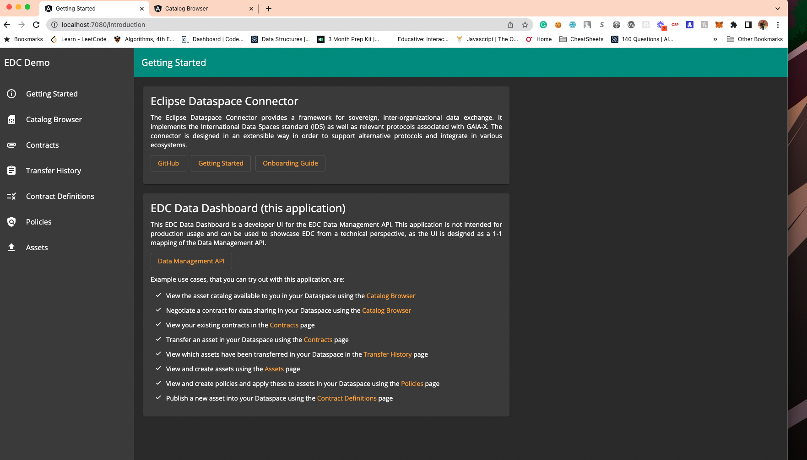
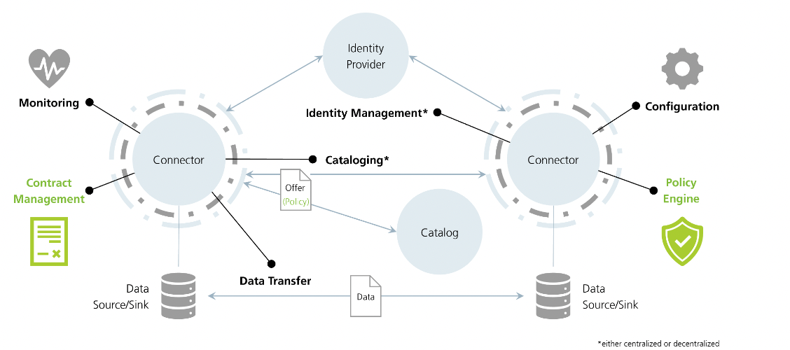

# Strategy to Deploy EDC

A decentralized dataspace can be deployed utilizing the concept of Minimum Viable DataSpace (MVD)

According to their documenation we should register the app(Cloned MVD) in our cloud environment. This app serves as our backend.For instance if we were to use Azure we could utilize Azure App Service. I believe we can achieve this on SAP BTP cockpit as well leveraging SAP Cloud Portal Service or something like that. My trial account was limited to most of the resources to both Azure and SAP BTP so I attemped running the instance of app on my local development. Once it is up and running it creates a dataspace(blue outlined circle) which looks identical to the image below:

Once our backend is deployed we create front end App out of the docker image. It should spin up the applciation and we should see a UI like the attached image.

This will be the place where policy/contract creation, and data transfer would occur.

## Local Development

I have made a short video demonstration by running an instance of the application in my local environment. This video demonstrates contract negotiation and data transfer between two entities or companies.

<a href="https://www.loom.com/share/5554bf963e404592b5139fdd259ad80a" target="_blank"> Demonstration Video ECD Local Environment</a>

Might want to increase the playback speed to 1.5x

# DataSpace Connector Architecture in Nutshell just for reference

